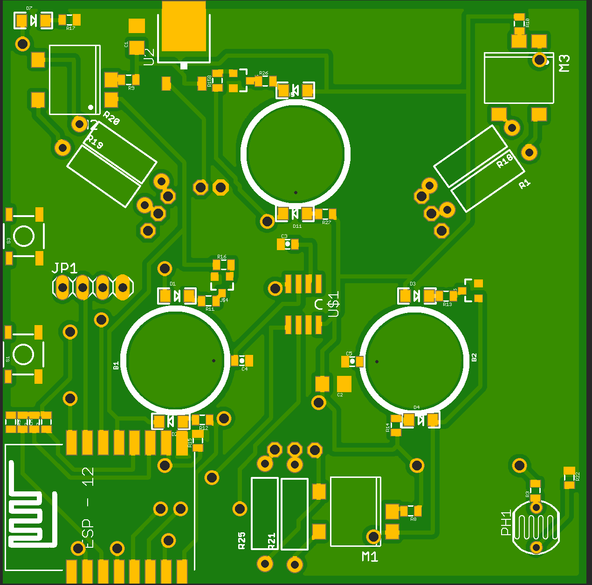
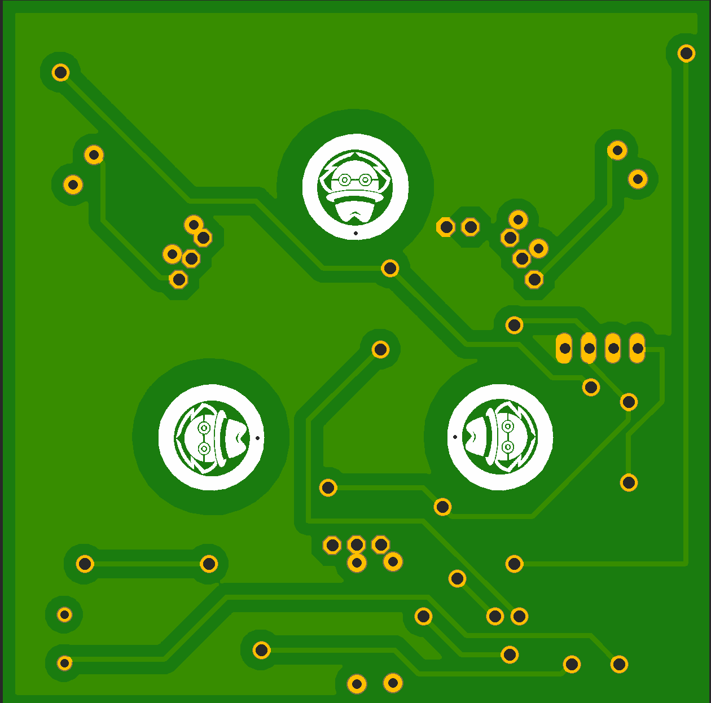

#  IoT Wall touch Socket 

This is a hardware of Wall touch Socket with three channel out , one lighting sensor and one tempreture sensor
This IoT product can control any 

### lighting

### Home Appliance

### HVAC system

device in thr building (BMS)

# Final product

# Prototype

# schematic

# PCB
,,

